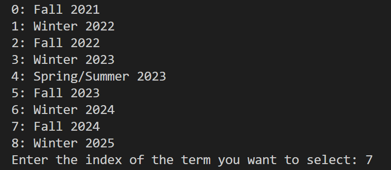
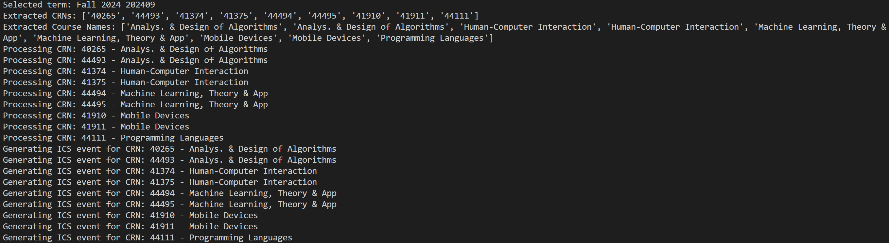
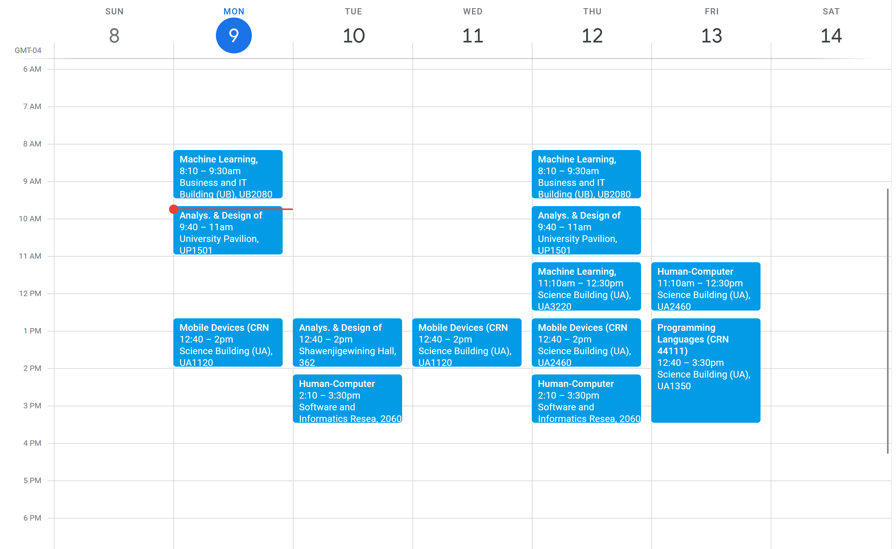

# Ontario-Tech-ICS-Generator
Converts a term schedule from Ontario Tech's mycampus website into a ICS file 

# Demo
Live Demo Screenshots below

ICS File Loaded into Google Calendar 

# Features
- Logs into Ontario Tech account to access schedule and term information
- Webscrapes course information
- Generates ICS file which is compatible with various Calendar applications such as Google Calendar

# Technologies Used
- Selenium
- Beautiful Soup
- icalendar 
- POST/GET requests 

# Contact 
If you have any questions, suggestions, or feedback, feel free to reach out to the project maintainer:

    Gieonne Sabijon
Thank you for your interest in this project!